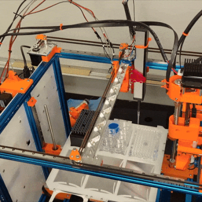

# 🔬🧪 Science Jubilee ⚡⚙️
### Controlling Jubilees for Science!

<!-- [](https://cirrus-ci.com/github/<USER>/science-jubilee) -->
[](https://science-jubilee.readthedocs.io/en/stable/)
<!--- [](https://coveralls.io/r/machineagency/science-jubilee) --->
[](https://pypi.org/project/science-jubilee/)
<!-- [](https://anaconda.org/conda-forge/science-jubilee) -->
[](https://pepy.tech/project/science-jubilee)
[](https://twitter.com/machine_agency)
[](https://pyscaffold.org/)

> Use an open-source toolchanger to do science

<p align="center"></p>

This repository hosts files to build and control a [Jubilee](https://jubilee3d.com/index.php?title=Main_Page) for scientific applications. The core of the software is a Python interface for Jubilee to navigate labware installed in the machine. We currently provide assembly instructions, control software, and examples for various tools including OT-2 pipettes, syringes, and cameras. While these tools might cater exactly to your planned use case, they most likely will not! We share these files as a starting point rather than an endpoint: we also provide instructions for developing new tools and associated software for controlling them. We hope you will build new tools for your application and contribute them back to the community for others to use and extend 🛠️

_Check out the [Documentation](https://science-jubilee.readthedocs.io/en/latest/index.html) to get started!_


## Overview
### Hardware
This repository is designed to be used with the Jubilee platform, outfitted with tools for laboratory automation. Jubilee an open-source & extensible multi-tool motion platform—if that doesn't mean much to you, you can think of it as a 3D printer that can change its tools. You can read about [Jubilee](https://jubilee3d.com/index.php?title=Main_Page) more generally at the project page.

### Software
The software here is intended to control Jubilee from Python scripts or Jupyter notebooks to design and run experiments. The folders are organized as follows:
```
calibration/                 # notebooks to support machine & tool setup/calibration
tool_library/                # design files, assembly instructions, & configuration info for all tools & plates
src/
└── science_jubilee/
    ├── Machine.py               # jubilee machine driver
    ├── tools/
    │   ├── configs/             # all tool configs are here
    │   ├── Tool.py              # base tool class
    │   └── ...                  # all tool modules are here
    ├── decks/
    │   ├── configs/             # all deck configs are here
    │   ├── Deck.py              # base deck class
    │   └── ...                  # all deck modules are here
    └── labware/
        ├── labware_definitions/ # all labware definitions are here
        └── Labware.py           # base labware class
```

### Labware and Wetware
The basic functionality supported by this software is intended to be used with a custom deck which accommodates up to 6 standard sized microplates.

### Using science_jubilee
You can import and use `science_jubilee` modules by importing the modules you need at the top of your python file/notebook. For example, if we want to pipette using a lab automation deck, we might write:
```python
from science_jubilee.Machine import Machine                             # import machine driver
from science_jubilee.decks.LabAutomationDeck import LabAutomationDeck   # import lab automation deck module
from science_jubilee.tools.Pipette import Pipette                       # import pipette module
...                                                                     # you can import other decks/tools here, or make your own!
```
We can then make use of these modules in our code:
```python
m = Machine()                                                  # connect to your jubilee
deck = m.load_deck(deck_config_name)                           # setup your deck
tip_rack = deck.load_labware(opentrons_96_tiprack_300ul, 0)    # install an opentrons tip rack in slot 0 of the deck
pipette = Pipette(<index>, <name>, <tip_rack>, <config_file>)  # instantiate your pipette tool
m.load_tool(pipette)                                           # configure the pipette for use on the machine
...
```

### MachineSession (recommended entry point)

`MachineSession` wires the full stack — transport, motion, tool-changer, deck navigator, camera, and light — into a single object.

**From a `.env` file (recommended)**

Put experiment-specific settings in a `.env` file next to your notebook or script:

```ini
JUBILEE_TRANSPORT=mock            # or: hardware
JUBILEE_ADDRESS=192.168.1.2       # required when TRANSPORT=hardware
JUBILEE_EXPERIMENT_DIR=my_exp/    # folder with deck.json, labware JSONs, gcode files
JUBILEE_DECK_DEF=deck             # stem of the deck JSON (auto-detected if omitted)
JUBILEE_GCODE_LOG=gcode_logs/latest.gcode
JUBILEE_CAMERA_ADDRESS=           # camera server IP (hardware only)
JUBILEE_NEOPIXEL_ADDRESS=         # LED server IP (hardware only)
JUBILEE_CAMERA_CALIB=calibration/camera_params.yaml
```

Then build the session:

```python
from science_jubilee.machine_session import MachineSession

session = MachineSession.from_env(".env")
session.free_navigator.move_to(x=100, y=50)
session.navigator.move_to_well(slot="0", well="A1")
```

**Explicit constructors**

```python
# Mock (no hardware required)
session = MachineSession.mock(
    deck_def="deck",
    experiment_dir=Path("my_exp/"),
)

# Real machine
session = MachineSession.hardware(
    address="192.168.1.2",
    deck_def="deck",
    experiment_dir=Path("my_exp/"),
    camera_address="192.168.1.3",
    led_address="192.168.1.4",
)
```

**Context manager**

```python
with MachineSession.from_env(".env") as s:
    s.motion.home_all()
```

Key attributes:

| Attribute | Type | Description |
|---|---|---|
| `session.motion` | `MotionDriver` | Low-level G-code motion |
| `session.tool_changer` | `ToolChanger` | Pick and park tools |
| `session.navigator` | `DeckNavigator` | Well-addressed deck navigation (requires `deck_def`) |
| `session.free_navigator` | `FreeNavigator` | Coordinate-based navigation |
| `session.camera` | `ToolheadCam` / mock | Camera capture |
| `session.light` | `Neopixel` / mock | LED ring control |

### Setting up a new tool with the HAL layer
For tool setup and calibration, a lower-level interface based on `MotionDriver` is available. It gives direct control over motion and handles generating the Duet firmware files needed for each tool (tpre, tpost, tfree):

```python
from science_jubilee.hal.transport.http import HTTPTransport
from science_jubilee.hal.motion_driver import MotionDriver
from science_jubilee.hal.tool_changer import ToolChanger
from science_jubilee.navigation import FreeNavigator
from science_jubilee.calibration.tool_gfiles import generate_tool_gfiles

# Connect
transport = HTTPTransport(address="10.0.3.48")
driver = MotionDriver(transport)
tc = ToolChanger(transport)
nav = FreeNavigator(driver, tc)

# Home the machine
nav.home_all()                          # runs homeall.g on the Duet

# Jog to find the parking post position
nav.move_to(z=150)
nav.move_to(x=150, y=150)
nav.jog(x=5, y=-2)                      # fine-tune with relative moves
print(nav.get_position())               # {"X": ..., "Y": ..., "Z": ...}

# Once you have your parking coordinates:
tool_number     = 0
x_park          = 120.0   # X position of the parking post
y_park          = 295.0   # Y position where tool is locked/released
y_clear         = 260.0   # Y position safely clear of all parking posts
manhattan_offset = 60.0   # approach offset added to x_park in tpre

# Generate tpre0.g, tpost0.g, tfree0.g and upload them to 0:/sys/ in one call
generate_tool_gfiles(
    tool_number=tool_number,
    x_park=x_park,
    y_park=y_park,
    y_clear=y_clear,
    manhattan_offset=manhattan_offset,
    transport=transport,                # omit to only write files locally
)
```

The generated files are written to `firmware/sys/` locally and, when `transport` is provided, uploaded directly to `0:/sys/` on the Duet — no copy-paste into DWC required.


<!-- pyscaffold-notes -->

## Development

### Setup

```powershell
pip install -e ".[testing,scripts]"
pre-commit install        # registers hooks in .git/hooks — run once per clone
```

### Pre-commit hooks

Every `git commit` automatically runs the following checks on staged files:

| Hook | What it does |
|---|---|
| `trailing-whitespace`, `end-of-file-fixer` | Whitespace cleanup |
| `check-ast` | Validates Python syntax |
| `check-json` | Validates JSON files |
| `check-yaml` | Validates YAML files |
| `debug-statements` | Blocks committed `pdb` / `ipdb` calls |
| `autoflake` | Removes unused imports |
| `isort` | Sorts imports (black-compatible profile) |
| `black` | Formats Python code |
| `pytest --jubilee-env mock` | Runs the full test suite in mock mode |

Most hooks are **auto-fixers**: they modify files in-place and then block the commit so you can review and re-stage the changes.

### Commit workflow

```powershell
git add -u                # stage all changes first — important!
git commit -m "message"   # hooks run automatically
```

If hooks modify files (black, isort, autoflake), the commit is blocked. Re-stage and retry:

```powershell
git add -u
git commit -m "message"   # hooks now pass on the already-formatted files
```

```
git commit         →  black modifies file.py  →  commit blocked
                                ↓
                    file.py now has unstaged changes
                                ↓
git add -u         →  those fixes are now staged
                                ↓
git commit         →  hooks pass (file already formatted)  →  committed ✓
```

> **Tip:** always `git add -u` before committing.

To run hooks manually on all files (useful before a PR):

```powershell
pre-commit run --all-files
```

### Running tests

```powershell
pytest --jubilee-env mock       # mock mode, no hardware needed
pytest --jubilee-env hardware   # requires a connected Jubilee at JUBILEE_ADDRESS
pytest -m "not invasive"        # skip tests that move the machine
```

<!-- pyscaffold-notes -->

## Note

This project has been set up using PyScaffold 4.5. For details and usage
information on PyScaffold see https://pyscaffold.org/.
